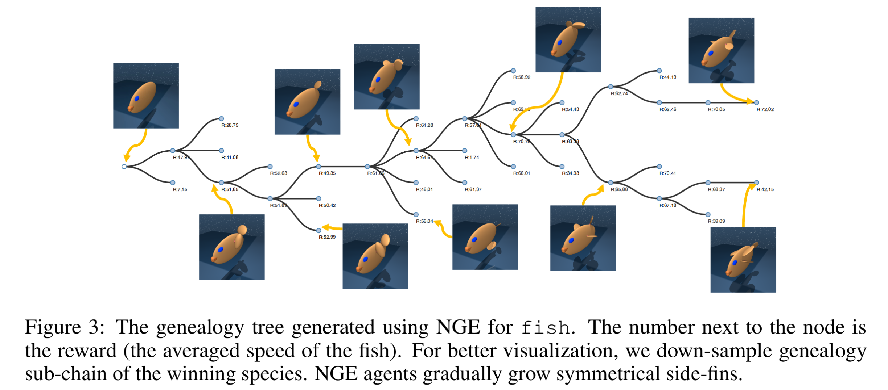
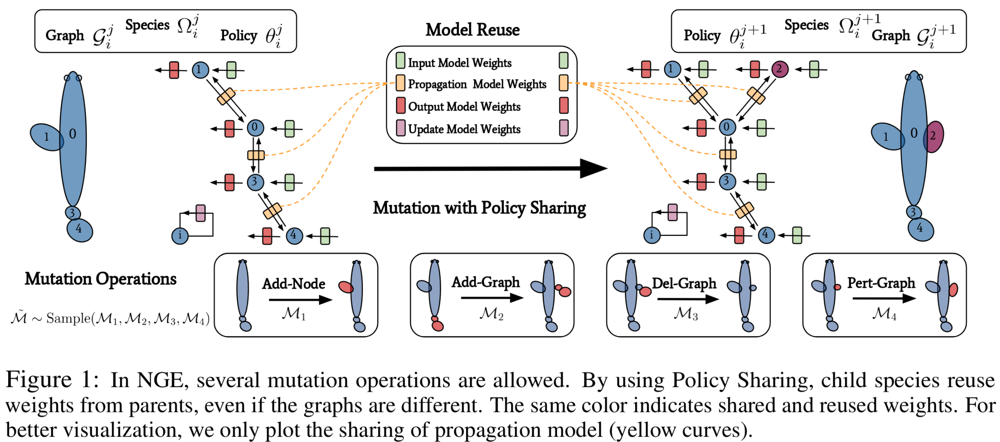
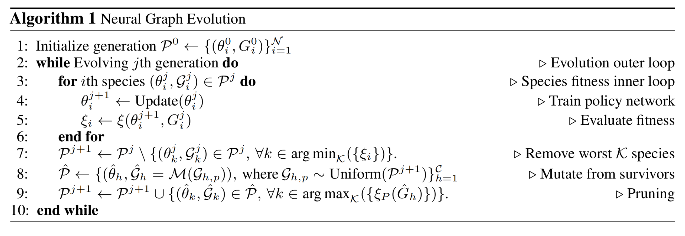
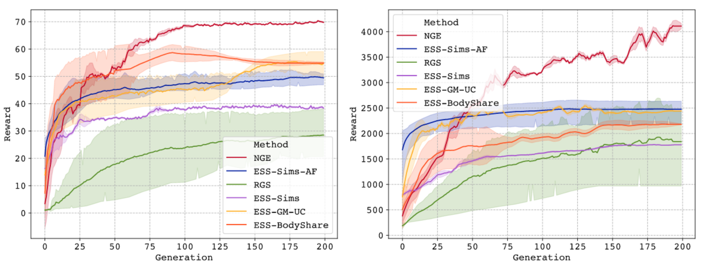
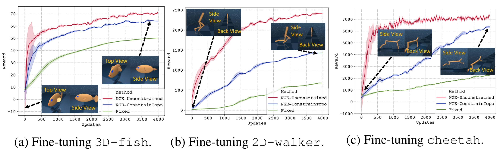
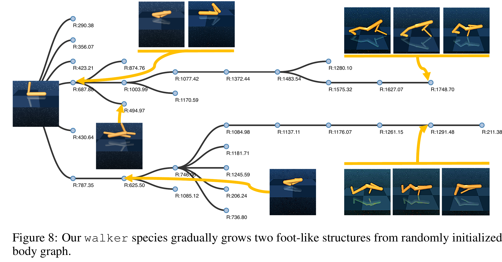

# Neural Graph Evolution: Towards Efficient Automatic Robot Design

<p align=center>

</p>
<p align=center>

</p>

[PDF](https://openreview.net/forum?id=BkgWHnR5tm)
**Abstract**: Despite the recent successes in robotic locomotion control, the design of robot relies heavily on human engineering. Automatic robot design has been a long studied subject, but the recent progress has been slowed due to the large combinatorial search space and the difficulty in evaluating the found candidates. To address the two challenges, we formulate automatic robot design as a graph search problem and perform evolution search in graph space. We propose Neural Graph Evolution (NGE), which performs selection on current candidates and evolves new ones iteratively. Different from previous approaches, NGE uses graph neural networks to parameterize the control policies, which reduces evaluation cost on new candidates with the help of skill transfer from previously evaluated designs. In addition, NGE applies Graph Mutation with Uncertainty (GM-UC) by incorporating model uncertainty, which reduces the search space by balancing exploration and exploitation. We show that NGE significantly outperforms previous methods by an order of magnitude. As shown in experiments, NGE is the first algorithm that can automatically discover kinematically preferred robotic graph structures, such as a fish with two symmetrical flat side-fins and a tail, or a cheetah with athletic front and back legs. Instead of using thousands of cores for weeks, NGE efficiently solves searching problem within a day on a single 64 CPU-core Amazon EC2 machine.

<p align=center>

</p>
# Installation
The repo uses [dm control suite](https://github.com/deepmind/dm_control).
Please make sure that you set up the MuJoCo-150 as instructed in the dm control github page.
Note that we need the specific branch of the @"merel_2017_humanoid".
Otherwise the reward scale and engineering design will be different.
The other packages can be installed by running the following commands.

```
pip install -r requirements
```

# Run The Code
To run the code, first go the `./tool` directory.
We have the demo scripts for running Neural Graph Evolution (NGE), ESS-SIMS and RGS.
<p align=center>

</p>

## Neural Graph Evolution (NGE)
Neural Graph Evolution is the algorithm proposed in our paper.
We refer the readers to the paper for detailed description. 
**Evolution Fish**: To generate the evolutionary fish creatures with NGE, you can run with the following script:
```
python evolution_main.py --task evofish3d-speed \
    --num_threads 63 --maximum_num_species=64 --start_num_species 63 \
    --gnn_embedding_option parameter --elimination_rate 0.3 \
    --body_num_line --new_species_struct --more_body_nodes_at_start --discrete_mutate \
    --evolutionary_sub_iteration=20 --num_total_generation=200 --timesteps_per_batch=2000 \
    --force_symmetric \
    --time_id NGE_fish
```
**Evolution Walker**:
```
python evolution_main.py --task evowalker-speed \
    --num_threads 63 --maximum_num_species=64 --start_num_species 63 \
    --gnn_embedding_option parameter --elimination_rate 0.3 \
    --body_num_line --new_species_struct --more_body_nodes_at_start --discrete_mutate \
    --evolutionary_sub_iteration=20 --num_total_generation=200 --timesteps_per_batch=2000 \
    --walker_force_no_sym --walker_more_constraint --force_grow_at_ends \
    --gnn_output_per_node 1
    --time_id NGE_walker
```

### Evolutionary Structure Search (ESS-Sims)
ESS-Sims is based on the pioneering work of (Sims, 1994).
We implement the algorithm using modern neural network structures and optimization methods.
It is used as a baseline in our paper.
**Evolution Fish**:
```
python evolution_main.py --task evofish3d-speed \
    --num_threads 63 --maximum_num_species=64 --start_num_species 63 \
    --gnn_embedding_option parameter --elimination_rate 0.3 \
    --body_num_line --new_species_struct --more_body_nodes_at_start --discrete_mutate \
    --evolutionary_sub_iteration=20 --num_total_generation=200 --timesteps_per_batch=2000 \
    --use_gnn_as_policy=0 --nervenetplus 0 --use_nervenet 0 \
    --fc_amortized_fitness 0 \
    --time_id ESS_SIMS_fish \
```

As an ablation study, we also apply the amortized fitness to the original ESS algorithm by turning on the amortized fitness option using `--fc_amortized_fitness 1`

### RGS
```
python evolution_main.py --brute_force_search \
    --task evofish3d-speed --num_threads 63 \
    --gnn_embedding_option parameter --maximum_num_species=64 \
    --body_num_line --new_species_struct \
    --evolutionary_sub_iteration=20 --num_total_generation=200 \
    --timesteps_per_batch=2000 --elimination_rate 0.3 \
    --start_num_species 63 \
    --more_body_nodes_at_start --discrete_mutate \
    --use_gnn_as_policy=0 --nervenetplus 0 --use_nervenet 0
    --time_id RGS_fish
```

## Fine-tuning of the Fish and Walker

<p align=center>

</p>
Fine-tuning the Fish environments:

```
python evolution_main.py --optimize_creature \
    --task evofish3d-speed --num_threads 63 --gnn_embedding_option noninput_separate \
    --maximum_num_species=64 --body_num_line --new_species_struct \
    --evolutionary_sub_iteration=20 --num_total_generation=200 \
    --timesteps_per_batch=2000 --elimination_rate 0.3 --start_num_species 63 \
    --more_body_nodes_at_start --time_id finetuning_fish
```
Fine-tuning the Cheetah environments:

```
python evolution_main.py --gnn_output_per_node=1 --optimize_creature \
    --task evocheetah-speed --num_threads 63 --gnn_embedding_option noninput_separate \
    --maximum_num_species=64 --body_num_line --new_species_struct \
    --evolutionary_sub_iteration=20 --num_total_generation=200 \
    --timesteps_per_batch=2000 --elimination_rate 0.3 --start_num_species 63 \
    --more_body_nodes_at_start --time_id finetuning_cheetah
```

Fine-tuning the Walker2d environments:
```
python evolution_main.py --gnn_output_per_node=1 --optimize_creature \
    --task evowalker-speed --num_threads 63 --gnn_embedding_option noninput_separate \
    --maximum_num_species=64 --body_num_line --new_species_struct \
    --evolutionary_sub_iteration=20 --num_total_generation=200 \
    --timesteps_per_batch=2000 --elimination_rate 0.3 --start_num_species 63 \
    --more_body_nodes_at_start --time_id finetuning_walker2d
```

# The hyper-parameters
We refer to `./config/evolutionary_config.py` and `./config/config.py` for the arguments for hyper-parameters.
Most of them are self-explanatory by their names.

## Setting up the Visdom Server.
If you have set up a visdom server, as illustrated in [facebookresearch/visdom](https://github.com/facebookresearch/visdom),
you can turn on the reward visualization by, for example if the port is 1234 with IP 192.168.0.1:
`python evolution_main.py --viz --vis_port 1234 --vis_server 192.168.0.1 ...`


# The Results
The results are recorded under the `./evolution_data/${time_id}`.
There are respectively three folders: `species_data`, `species_topology`, `species_video`.
We refer to `evolution_data/README.md` for details.


# Reference
Sims, K. (1994, July). Evolving virtual creatures. In Proceedings of the 21st annual conference on Computer graphics and interactive techniques (pp. 15-22). ACM.

<p align=center>

</p>
